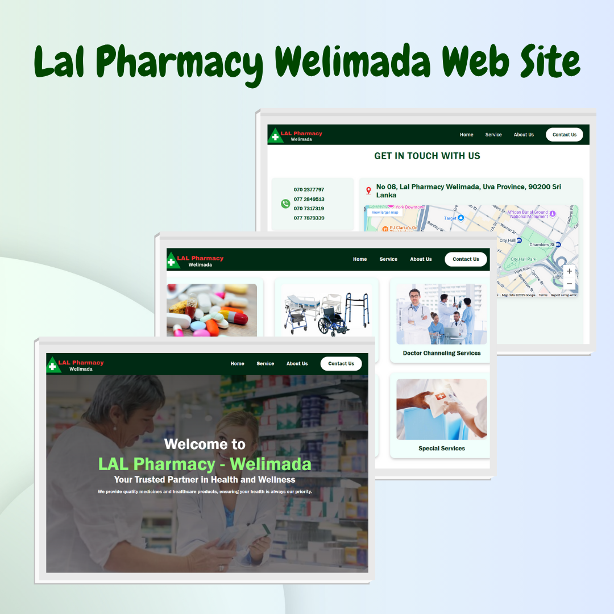

# 💊 LAL Pharmacy - Welimada Website

  

A fully responsive website designed and developed for **LAL Pharmacy - Welimada** using **React.js** and **Tailwind CSS**. This site showcases the pharmacy's services, allows customers to browse medicine and grocery items, and supports online ordering.

---

## 🚀 Website

👉 [View Website](https://lal-pharmacy-x2oj-git-main-hirunis-projects-d4d75fef.vercel.app)

---

## 🛠️ Tech Stack

- **Frontend:** React.js
- **Styling:** Tailwind CSS

---

## 📱 Key Features

- ✅ **Home Page** – Welcome section with CTA and quick access to services.
- ✅ **About Us** – Story and vision of LAL Pharmacy.
- ✅ **Our Services**
  - 🩺 Medicine
  - 👨‍⚕️ Channeling Center
  - 🛒 Grocery Items
- ✅ **Online Ordering System** – Easily place orders for delivery.
- ✅ **Contact Page** – Embedded form for customer inquiries.
- ✅ **Responsive Design** – Mobile, tablet, and desktop support.

---

